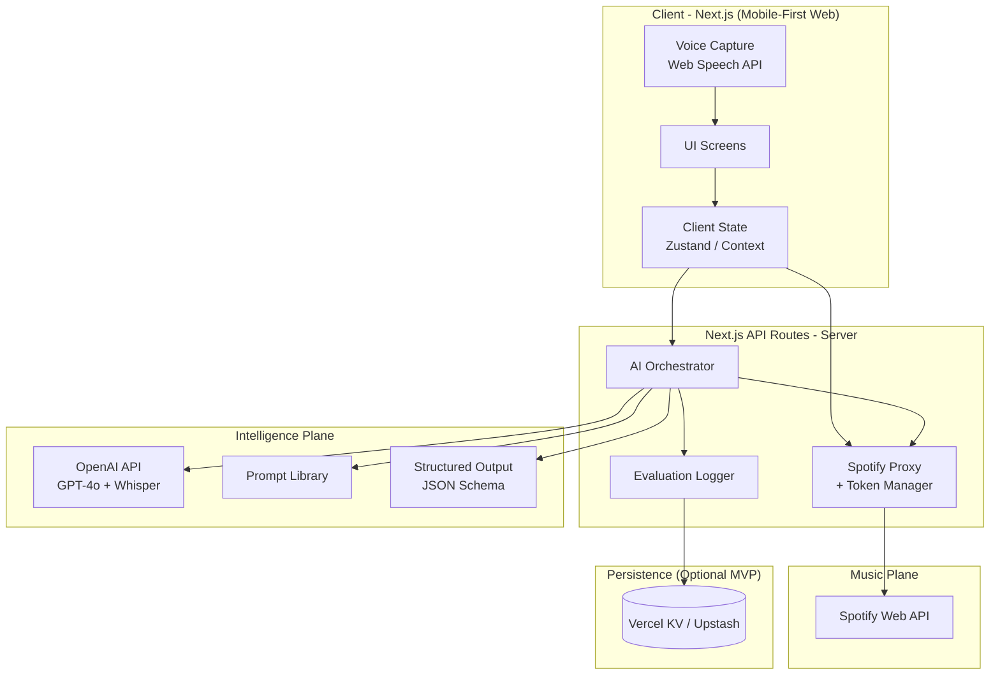
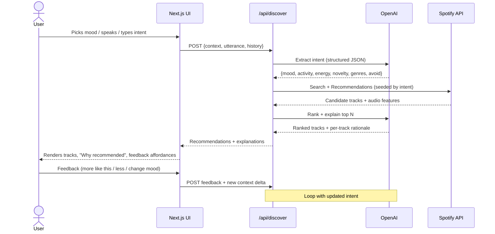
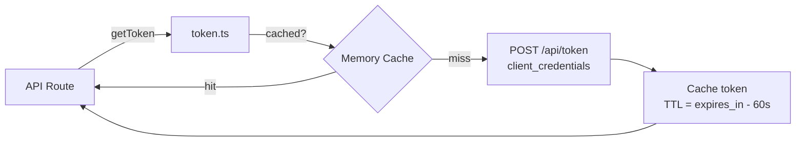
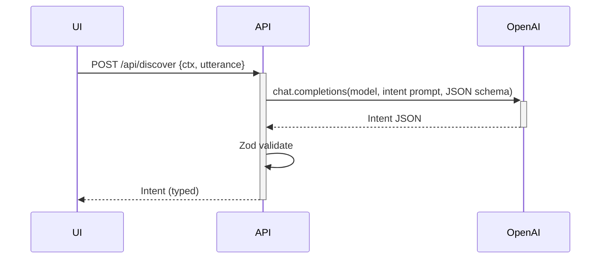
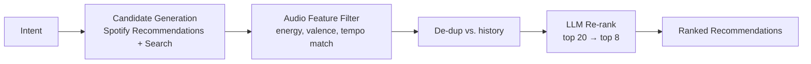
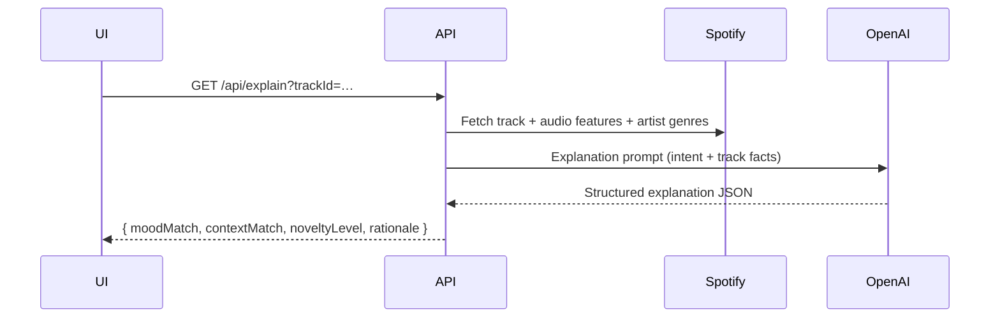
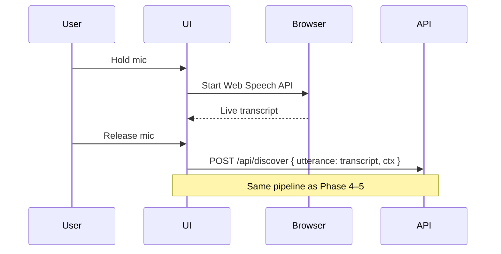
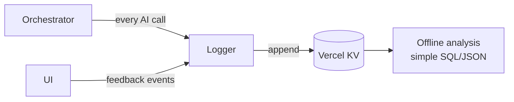

# Spotify Aura — Phase-Wise Architecture

A detailed, build-order architecture for the **Spotify Aura** MVP described in [`problemstatement.md`](./problemstatement.md).

This document is the engineering counterpart of the product spec. It is structured so that each phase produces a **working, demoable slice** of the product, and so that later phases stack cleanly on the foundation laid by earlier ones.

---

## Table of Contents

1. [System Overview](#1-system-overview)
2. [High-Level Architecture](#2-high-level-architecture)
3. [End-to-End Discovery Flow](#3-end-to-end-discovery-flow)
4. [Final Folder Structure](#4-final-folder-structure)
5. [Phase 0 — Foundation & Setup](#phase-0--foundation--setup)
6. [Phase 1 — UI Shell & Design System](#phase-1--ui-shell--design-system)
7. [Phase 2 — Spotify API Integration](#phase-2--spotify-api-integration)
8. [Phase 3 — Context Capture Layer](#phase-3--context-capture-layer)
9. [Phase 4 — AI Brain (Text Discovery)](#phase-4--ai-brain-text-discovery)
10. [Phase 5 — Recommendation Engine](#phase-5--recommendation-engine)
11. [Phase 6 — Explainability Layer](#phase-6--explainability-layer)
12. [Phase 7 — Voice Discovery](#phase-7--voice-discovery)
13. [Phase 8 — Feedback & Adaptation Loop](#phase-8--feedback--adaptation-loop)
14. [Phase 9 — Evaluation & Telemetry](#phase-9--evaluation--telemetry)
15. [Phase 10 — Polish, Deploy, Launch](#phase-10--polish-deploy-launch)
16. [Cross-Cutting Concerns](#16-cross-cutting-concerns)
17. [Risks & Mitigations](#17-risks--mitigations)

---

## 1. System Overview

Spotify Aura is a **mobile-first Next.js web app** that sits between the user and Spotify, with an **AI orchestration layer** (OpenAI) in the middle.

The system has three logical planes:

| Plane | Responsibility | Where it lives |
|---|---|---|
| **Experience Plane** | Mobile-first UI, conversation, voice, context capture, explanations | Next.js App Router + React + Tailwind |
| **Intelligence Plane** | Intent extraction, context understanding, recommendation reasoning, explanation generation | Next.js API routes + OpenAI |
| **Music Plane** | Track metadata, audio features, search, recommendations, playback links | Spotify Web API |

The product *intentionally* decouples **what the user wants right now** (Intelligence Plane) from **what music exists** (Music Plane). The AI reasons about intent; Spotify supplies the catalog.

---

## 2. High-Level Architecture



**Key architectural choices:**

- **Server-side AI calls only.** The OpenAI key never reaches the browser.
- **Spotify proxy pattern.** All Spotify calls go through `/api/spotify/*` so tokens, rate limits, and retries stay server-side.
- **Structured AI outputs.** OpenAI calls use JSON Schema / function calling so downstream code receives typed objects, not free-form text.
- **Stateless MVP.** No database required for v1; recent context lives in client state. Vercel KV is optional for evaluation logs.

---

## 3. End-to-End Discovery Flow



This is the **single core loop** the product is built around. Every phase below either implements a slice of this loop or makes it better, faster, or more explainable.

---

## 4. Final Folder Structure

The target structure after all phases are complete:

```
spotify-aura/
├── app/                              # Next.js App Router
│   ├── (discovery)/
│   │   ├── page.tsx                  # Screen 1: Discovery Home
│   │   ├── conversation/page.tsx     # Screen 2: AI Conversation
│   │   ├── context/page.tsx          # Screen 3: Context Capture
│   │   ├── results/page.tsx          # Screen 4: AI Recommendations
│   │   ├── why/[trackId]/page.tsx    # Screen 5: Why Recommended
│   │   └── feedback/page.tsx         # Screen 6: Discovery Feedback
│   ├── api/
│   │   ├── discover/route.ts         # Main discovery orchestrator
│   │   ├── explain/route.ts          # Per-track explanation
│   │   ├── feedback/route.ts         # Feedback loop
│   │   ├── voice/transcribe/route.ts # Whisper transcription
│   │   ├── spotify/
│   │   │   ├── token/route.ts        # Client-credentials token
│   │   │   ├── search/route.ts
│   │   │   ├── recommendations/route.ts
│   │   │   └── audio-features/route.ts
│   │   └── eval/log/route.ts         # AI metric telemetry
│   ├── layout.tsx
│   └── globals.css
├── components/
│   ├── ui/                           # Primitives (Button, Sheet, Pill, etc.)
│   ├── discovery/
│   │   ├── MoodPicker.tsx
│   │   ├── ActivitySelector.tsx
│   │   ├── EnergySlider.tsx
│   │   ├── ExplorationSlider.tsx
│   │   ├── AvoidArtistInput.tsx
│   │   ├── ConversationThread.tsx
│   │   ├── VoiceButton.tsx
│   │   ├── TrackCard.tsx
│   │   ├── ExplanationPanel.tsx
│   │   └── FeedbackBar.tsx
│   └── layout/
│       ├── BottomNav.tsx
│       └── AuraHeader.tsx
├── lib/
│   ├── ai/
│   │   ├── client.ts                 # OpenAI client
│   │   ├── prompts/
│   │   │   ├── intent.ts
│   │   │   ├── rank.ts
│   │   │   ├── explain.ts
│   │   │   └── feedback.ts
│   │   ├── schemas/                  # Zod schemas for structured outputs
│   │   │   ├── intent.schema.ts
│   │   │   ├── ranking.schema.ts
│   │   │   └── explanation.schema.ts
│   │   └── orchestrator.ts           # The discovery pipeline
│   ├── spotify/
│   │   ├── client.ts
│   │   ├── token.ts
│   │   ├── search.ts
│   │   ├── recommendations.ts
│   │   └── audio-features.ts
│   ├── state/
│   │   └── discoveryStore.ts         # Zustand store
│   ├── eval/
│   │   ├── metrics.ts                # 5 AI evaluation metrics
│   │   └── logger.ts
│   └── utils/
│       ├── voice.ts                  # Web Speech API helpers
│       └── types.ts
├── styles/
│   └── tokens.css                    # Spotify-aligned design tokens
├── public/
├── docs/
│   ├── problemstatement.md
│   └── architecture.md
├── .env.local.example
├── next.config.ts
├── tailwind.config.ts
├── tsconfig.json
└── package.json
```

---

## Phase 0 — Foundation & Setup

**Goal:** Bootstrap a clean Next.js + TypeScript + Tailwind project with working environment, linting, and deployment pipeline. Nothing user-facing yet — just rails.

### Deliverables

- Next.js 14+ (App Router) + TypeScript + TailwindCSS scaffolded
- ESLint + Prettier configured
- `.env.local.example` documenting every secret
- Vercel project linked; preview deploys working on push
- Folder skeleton (`app/`, `components/`, `lib/`, `docs/`) committed
- Health-check route at `/api/health`

### Environment Variables

| Variable | Purpose |
|---|---|
| `OPENAI_API_KEY` | Server-side OpenAI access |
| `SPOTIFY_CLIENT_ID` | Spotify app credentials |
| `SPOTIFY_CLIENT_SECRET` | Spotify app credentials |
| `NEXT_PUBLIC_APP_URL` | Base URL (for OAuth redirects if added later) |
| `KV_REST_API_URL` *(optional)* | Vercel KV / Upstash for eval logs |
| `KV_REST_API_TOKEN` *(optional)* | Vercel KV / Upstash auth |

### Definition of Done

- `npm run dev` works locally
- `/api/health` returns `{ ok: true }` on Vercel preview
- Repo passes lint + type-check on CI

---

## Phase 1 — UI Shell & Design System

**Goal:** Build the Spotify-aligned visual identity and the six MVP screen skeletons. No real data yet — everything is mocked.

### What gets built

- **Design tokens** (`styles/tokens.css`) — Spotify-inspired palette: deep black `#121212`, off-black surface `#181818`, Spotify green `#1DB954`, text greys, with an *Aura accent* gradient (e.g. purple → blue) to visually distinguish AI surfaces from stock Spotify.
- **Type system** — Circular-style stack (fallback to Inter + system sans).
- **UI primitives** in `components/ui/`: `Button`, `Pill`, `Sheet`, `Card`, `Slider`, `Tag`, `Skeleton`.
- **Layout components** — `AuraHeader`, `BottomNav`, mobile-first `max-w-md` mx-auto shell.
- **Six screen skeletons** wired to App Router at the paths in [Section 4](#4-final-folder-structure).
- **Mock data fixtures** in `lib/utils/mocks.ts` so screens can render end-to-end.

### Architecture decisions

- **Mobile-first only** at MVP. No desktop layout work.
- **Server Components by default**, Client Components (`"use client"`) only for interactive widgets (sliders, voice, conversation).
- **No global CSS framework beyond Tailwind.** Spotify look comes from tokens + component composition.

### Definition of Done

- All six screens navigable on mobile viewport
- Visual review: feels like a Spotify feature, not a generic app
- Lighthouse mobile score ≥ 90 on the shell

---

## Phase 2 — Spotify API Integration

**Goal:** Server-side access to Spotify's catalog using **Client Credentials Flow** (no user login needed for MVP).

### Why Client Credentials (not Authorization Code)

| Concern | Client Credentials | Authorization Code |
|---|---|---|
| User login required | No | Yes |
| Access to user's library | No | Yes |
| Access to public catalog | Yes | Yes |
| MVP complexity | Low | High |
| Sufficient for discovery demo | **Yes** | Overkill |

The MVP demonstrates *discovery intelligence*, which only needs catalog access. Personal library integration is a Phase-11+ concern, not MVP.

### Components

| Module | Purpose |
|---|---|
| `lib/spotify/token.ts` | Fetch + cache app token (~1h TTL) |
| `lib/spotify/client.ts` | Fetch wrapper with retries, 429 backoff, JSON parse |
| `lib/spotify/search.ts` | `searchTracks(q, limit)`, `searchArtists` |
| `lib/spotify/recommendations.ts` | `getRecommendations({seedGenres, seedTracks, targetAudioFeatures})` |
| `lib/spotify/audio-features.ts` | Batch fetch valence, energy, danceability, tempo, acousticness |
| `app/api/spotify/*` | Thin route handlers proxying the above |

### Token strategy



### Definition of Done

- `/api/spotify/search?q=…` returns tracks
- `/api/spotify/recommendations` returns seed-based recs
- Audio features are batch-fetched (max 100/call)
- 429s handled with exponential backoff

---

## Phase 3 — Context Capture Layer

**Goal:** Capture the user's *current state* — mood, activity, energy, exploration appetite, artists to avoid — and persist it through the session.

### Data model

```ts
// lib/utils/types.ts
export type DiscoveryContext = {
  mood?: string;              // "melancholic", "hyped", "focused"…
  activity?: string;          // "studying", "driving", "workout"…
  energy: number;             // 0–1 slider
  exploration: number;        // 0 = familiar, 1 = adventurous
  avoidArtists: string[];
  avoidGenres: string[];
  freeText?: string;          // open-ended user input
};

export type DiscoverySession = {
  context: DiscoveryContext;
  utterances: Array<{ role: "user" | "aura"; text: string; ts: number }>;
  lastIntent?: ExtractedIntent;
  history: TrackId[];         // already-shown to avoid repeats
};
```

### Components

- **`MoodPicker`** — 8–12 mood pills (Spotify-style chips)
- **`ActivitySelector`** — grid of activity cards with subtle iconography
- **`EnergySlider`** — visual gradient slider
- **`ExplorationSlider`** — "Stay close ←→ Surprise me"
- **`AvoidArtistInput`** — typeahead backed by `/api/spotify/search?type=artist`

### State management

`lib/state/discoveryStore.ts` — a **Zustand** store, persisted to `sessionStorage` so a refresh doesn't wipe the session. Server routes are stateless; state lives on the client and is sent as part of each request body.

### Definition of Done

- Context capture screen produces a fully-typed `DiscoveryContext`
- Store persists across navigation
- Avoid-artist typeahead works against real Spotify data

---

## Phase 4 — AI Brain (Text Discovery)

**Goal:** Turn natural-language user input + context into a **structured intent object** that downstream layers can act on.

This is the heart of the Intelligence Plane.

### Intent schema (Zod)

```ts
// lib/ai/schemas/intent.schema.ts
export const IntentSchema = z.object({
  mood: z.string(),                      // canonical mood label
  activity: z.string().optional(),
  energyTarget: z.number().min(0).max(1),
  valenceTarget: z.number().min(0).max(1),
  danceabilityTarget: z.number().min(0).max(1).optional(),
  tempoRange: z.tuple([z.number(), z.number()]).optional(),
  seedGenres: z.array(z.string()).max(5),
  noveltyLevel: z.enum(["familiar", "adjacent", "exploratory", "left_field"]),
  avoidArtists: z.array(z.string()),
  avoidGenres: z.array(z.string()),
  rationale: z.string(),                 // model's internal reasoning trace
});
```

### Prompt design

`lib/ai/prompts/intent.ts` follows a three-part structure:

1. **System prompt** — defines Aura's role, the canonical mood/genre vocabularies, and the audio-feature mapping rules.
2. **Few-shot examples** — 4–6 hand-crafted (utterance → intent JSON) pairs covering common cases.
3. **User turn** — current `DiscoveryContext` + latest utterance + recent conversation history.

The model is called with **`response_format: { type: "json_schema" }`** so the output is guaranteed to conform.

### Orchestrator

```ts
// lib/ai/orchestrator.ts
export async function extractIntent(
  ctx: DiscoveryContext,
  utterance: string,
  history: Utterance[]
): Promise<ExtractedIntent> { … }
```

### Flow



### Definition of Done

- Text input → validated `ExtractedIntent` in < 2s p95
- 10 hand-written test utterances each pass schema validation
- Conversation history (last 6 turns) is incorporated into intent

---

## Phase 5 — Recommendation Engine

**Goal:** Combine `ExtractedIntent` + Spotify's catalog into a ranked list of tracks the user will actually want to discover.

### Two-stage pipeline



#### Stage 1 — Candidate generation (deterministic, fast)

Use Spotify's `/recommendations` endpoint with:

- `seed_genres` from intent (up to 5)
- `target_energy`, `target_valence`, `target_danceability`, `target_tempo`
- `min_*` / `max_*` bounds for novelty control

This returns ~50 candidates in a single call. We then **filter out**: avoided artists, avoided genres, and anything in `session.history`.

#### Stage 2 — LLM re-ranking (qualitative, slow)

The deterministic stage matches *audio shape*; the LLM stage matches *vibe and narrative*. We send the top 20 candidates (with title, artist, year, genres, brief audio-feature summary) back to GPT-4o with a re-ranking prompt that asks: *"Given the user's intent, pick and order the 8 that best deliver on what they asked for, and ensure diversity of artists and sub-styles."*

The model returns **`{trackId, rank, vibeMatch, noveltyMatch, oneLineHook}`** per pick.

### Why two stages

| | Pure Spotify recs | Pure LLM recs | Two-stage (Aura) |
|---|---|---|---|
| Catalog coverage | Full | Limited to training data | Full |
| Vibe nuance | Low | High | High |
| Latency | Fast | Slow | Moderate |
| Hallucination risk | None | High (fake tracks) | None (LLM only ranks real Spotify IDs) |

### Definition of Done

- `/api/discover` returns 8 ranked tracks with a one-line hook each
- All track IDs verified against Spotify (no hallucinated tracks)
- Artist diversity: at most 2 tracks per artist in any result set

---

## Phase 6 — Explainability Layer

**Goal:** Deliver on the product's core differentiator — *"Why was this recommended?"*

### What "explanation" means here

For each track, Aura surfaces **four distinct signals**:

| Signal | What it shows | Source |
|---|---|---|
| **Mood Match** | Why this track fits the captured mood | LLM, grounded in audio features |
| **Context Match** | How it serves the activity / time / energy | LLM, grounded in intent |
| **Novelty Level** | How far this is from the user's familiar zone | Computed (genre / artist distance) |
| **Discovery Rationale** | One-paragraph narrative tying it together | LLM |

### Architecture

Explanations are generated **lazily on Screen 5 (`/why/[trackId]`)**, not in the main discovery call. This keeps Phase 5 fast and avoids burning tokens on tracks the user never inspects.



### Anti-hallucination guard

The explanation prompt is **constrained**: the model must reference *only* the audio-feature values and genres we pass it. A post-validation step rejects any output mentioning artists/tracks not in the supplied context.

### Definition of Done

- "Why recommended" screen renders four-signal breakdown in < 2s
- Novelty score is computed deterministically from genre/artist distance, not hallucinated
- Zero references to facts not present in the prompt context (verified via spot-check)

---

## Phase 7 — Voice Discovery

**Goal:** Let users speak their intent instead of typing it. This is the highest-leverage interaction mode for the target segment.

### Two implementation paths

| Approach | Pros | Cons | MVP choice |
|---|---|---|---|
| **Browser Web Speech API** | Zero latency, free, no backend | Inconsistent across browsers, accuracy varies | ✅ Default |
| **Whisper API (server-side)** | High accuracy, multilingual, consistent | Latency, cost, requires audio upload | ✅ Fallback / "high-accuracy" toggle |

The MVP ships **Web Speech API as primary** with a server-side `/api/voice/transcribe` Whisper fallback used when:

- `webkitSpeechRecognition` is unavailable (Firefox, some Safari)
- The user enables "High accuracy mode"
- The first attempt returned empty / low-confidence text

### Components

- **`VoiceButton`** — press-and-hold mic affordance with waveform animation
- **`useVoiceCapture` hook** — abstracts Web Speech vs. Whisper, returns `{ transcript, isListening, confidence, error }`
- **`/api/voice/transcribe`** — accepts audio blob (multipart), returns text via Whisper

### Flow



### Definition of Done

- "I'm driving late at night and want emotional songs" → recommendations in < 4s end-to-end
- Graceful fallback when Web Speech is unsupported
- Visible waveform / state during capture

---

## Phase 8 — Feedback & Adaptation Loop

**Goal:** Close the loop. Let users steer Aura *during* a session: *"more like this", "less similar", "change mood", "more adventurous"*.

### Feedback primitives

| Action | Effect on next call |
|---|---|
| ❤️ More like this | Add track as `seed_tracks`, nudge intent toward its audio features |
| 👎 Less similar | Add artist/genre to soft-avoid list, drop similar candidates |
| 🔀 More adventurous | Increase `exploration` slider; widen genre seeds |
| 🎭 Change mood | Re-open Context Capture sheet with prior values pre-filled |
| 🔁 More from this artist | Pin artist as priority seed for next call |

### Architecture

Feedback is **additive context**, not a separate model. It mutates the in-memory `DiscoverySession` and the next `/api/discover` call sees the updated state. No retraining, no embeddings store needed for MVP.

```ts
// lib/state/discoveryStore.ts
applyFeedback(action: FeedbackAction, trackId: string) {
  // mutates session.context + session.history + session.seeds
}
```

### Definition of Done

- Every track card has feedback affordances
- Two consecutive feedback actions visibly shift the next result set (verified manually)
- "Change mood" preserves conversation history but resets intent

---

## Phase 9 — Evaluation & Telemetry

**Goal:** Instrument the five AI evaluation metrics from the spec so we can prove Aura works, not just claim it does.

### The five metrics

| Metric | Target | How we measure |
|---|---|---:|
| Context Understanding Accuracy | ≥ 90% | Offline eval set of 50 utterances; compare extracted intent vs. ground truth labels |
| Recommendation Relevance | ≥ 80% | User thumbs-up rate on first 3 results per session |
| Recommendation Diversity | High | Artist-uniqueness ratio + genre-entropy per result set |
| Explanation Quality | ≥ 85% | In-app "Did this explanation help?" micro-survey |
| Discovery Satisfaction | ≥ 75% | End-of-session 1-tap rating |

### Logging architecture



Each event logs: `sessionId`, `phase` (`intent | rank | explain | feedback`), `latency`, `tokenUsage`, `outcome`, `userSignal`. No PII — `sessionId` is an anonymous UUID stored in `sessionStorage`.

### Offline eval harness

`scripts/eval/run.ts` — runs the 50-utterance eval set against the production pipeline and prints a metrics report. Run before every meaningful prompt change.

### Definition of Done

- All five metrics emit events
- Eval harness runs locally and prints a pass/fail table
- KV (or local JSON) persists logs across sessions

---

## Phase 10 — Polish, Deploy, Launch

**Goal:** Ship a demo-quality, production-feeling experience.

### Performance budget

| Budget | Target |
|---|---|
| First Contentful Paint (mobile, 4G) | < 1.5s |
| Time to first recommendation | < 4s |
| Lighthouse Performance (mobile) | ≥ 90 |
| Lighthouse Accessibility | ≥ 95 |
| Bundle (initial JS) | < 200 KB gz |

### Polish checklist

- Skeleton states for every async surface
- Empty states + error states with retry affordances
- Optimistic UI on feedback actions
- Reduced-motion + dark-only theme polish
- Touch targets ≥ 44px
- Keyboard navigability
- OG image + favicon + manifest for "Add to Home Screen"

### Deploy

- Vercel production deployment behind a custom subdomain
- Environment variables in Vercel project settings
- Edge runtime for `/api/spotify/*` (low-latency catalog calls)
- Node runtime for `/api/discover`, `/api/explain` (OpenAI SDK + Zod)
- Web Analytics enabled

### Definition of Done

- Public URL works on a real phone
- All 6 screens reachable in a single session walkthrough
- README + demo script ready

---

## 16. Cross-Cutting Concerns

### Security

| Concern | Mitigation |
|---|---|
| OpenAI key leak | Server-only env var; never imported in `app/` client components |
| Spotify key leak | Same — proxied through `/api/spotify/*` |
| Prompt injection | System prompt is hardened; user text is wrapped in `<user_input>` delimiters; structured output schema prevents free-form action execution |
| LLM hallucinated track IDs | Re-ranker only operates on Spotify-returned IDs; explanations are post-validated |
| Rate-limit abuse | Per-IP rate limit on `/api/discover` via Vercel KV counter |

### State & persistence

- **Session state:** Zustand in `sessionStorage` — survives reload, dies on tab close.
- **Cross-session preferences (post-MVP):** localStorage + opt-in cloud sync.
- **No user accounts in MVP.**

### Caching

| Layer | What | TTL |
|---|---|---|
| Spotify token | App access token | ~55 min |
| Spotify search results | Query → results | 10 min (in-memory) |
| Spotify audio features | trackId → features | 24 hours (KV) |
| LLM intent extraction | Hash(ctx+utterance) → intent | Not cached — context changes too often |

### Observability

- Structured logs on every API route (`pino`)
- Vercel Web Analytics for client metrics
- Token-usage dashboard derived from eval logs

### Accessibility

- WCAG AA contrast on all surfaces
- Voice button has a clear text-input alternative
- All ARIA labels for icon-only buttons
- `prefers-reduced-motion` respected on waveform / shimmer animations

---

## 17. Risks & Mitigations

| Risk | Impact | Mitigation |
|---|---|---|
| LLM latency tanks UX | High | Two-stage pipeline; stream the re-rank response; show skeleton tracks immediately from Stage 1 |
| Spotify rate limits during demo | High | App-token caching; in-memory result caching; pre-warm common seeds |
| LLM hallucinates tracks | High | Re-ranker only sees Spotify-returned IDs; reject any output ID not in the candidate set |
| Voice accuracy poor on target browsers | Medium | Whisper fallback path; clear text alternative |
| Recommendation diversity collapses | Medium | Hard cap of 2 tracks per artist; genre-entropy floor in re-rank prompt |
| Prompt drift between phases | Medium | Centralized prompt library in `lib/ai/prompts`; eval harness gates prompt changes |
| Token cost spikes | Low | Lazy explanations (Phase 6); cap conversation history at 6 turns; use 4o-mini for re-rank where quality permits |
| Spotify Client Credentials can't access user library | By design | MVP demonstrates discovery intelligence on the public catalog; user-library personalization is a v2 concern |

---

## Phase Sequencing Cheat Sheet

```mermaid
gantt
    title Spotify Aura — Build Order
    dateFormat  X
    axisFormat %s
    section Foundation
    Phase 0 Setup            :done,    p0, 0, 1
    Phase 1 UI Shell         :active,  p1, 1, 3
    section Plumbing
    Phase 2 Spotify API      :         p2, 2, 4
    Phase 3 Context Capture  :         p3, 3, 5
    section Intelligence
    Phase 4 AI Brain         :         p4, 5, 7
    Phase 5 Recommendations  :         p5, 6, 8
    Phase 6 Explainability   :         p6, 8, 9
    section Differentiation
    Phase 7 Voice            :         p7, 9, 10
    Phase 8 Feedback Loop    :         p8, 9, 11
    section Ship
    Phase 9 Evaluation       :         p9, 10, 12
    Phase 10 Polish + Launch :         p10, 11, 13
```



Phases 2 and 3 can run in parallel after Phase 1. Phases 7 and 8 can run in parallel after Phase 6. Phase 9 instrumentation should be added incrementally *as* each Intelligence-Plane phase lands, not bolted on at the end.

---

## Related Documents

- [`problemstatement.md`](./problemstatement.md) — Product spec, user research, and MVP scope
