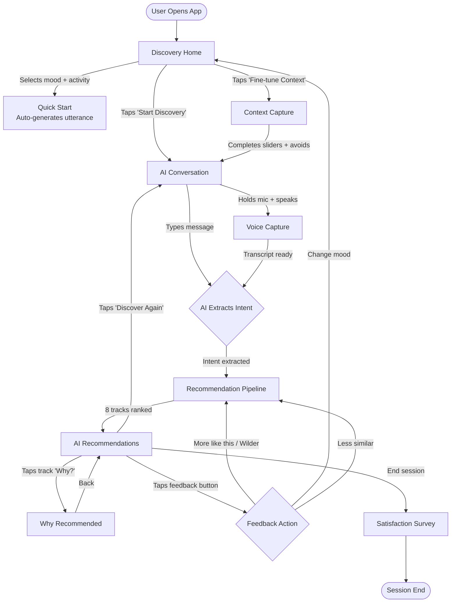
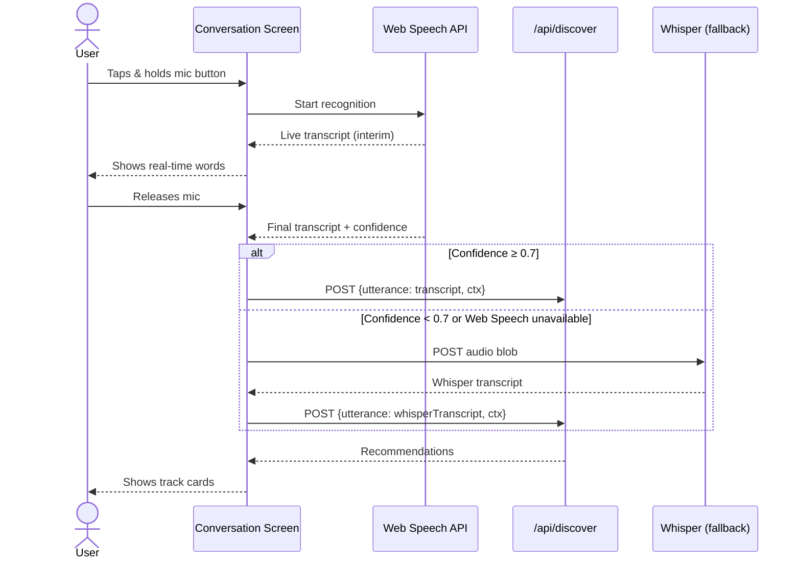
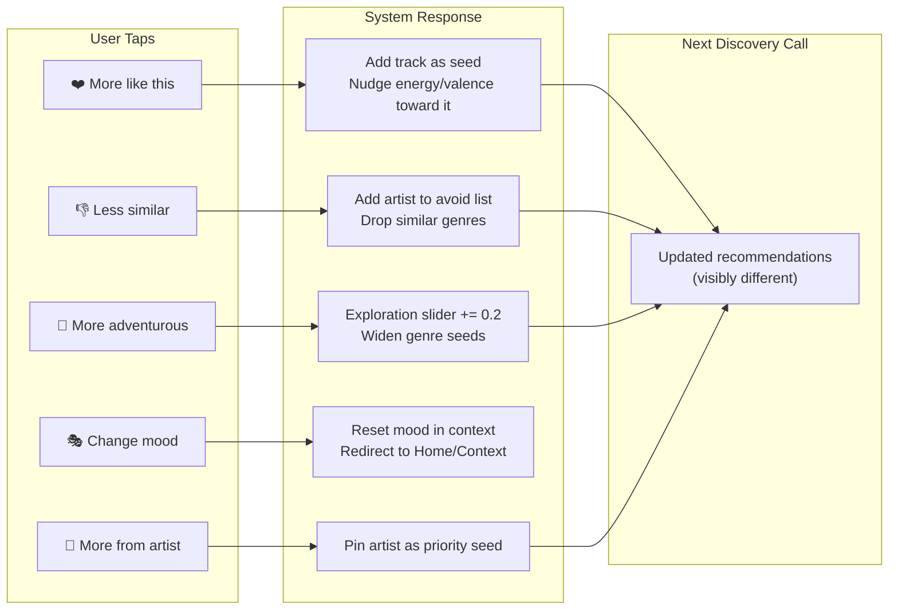
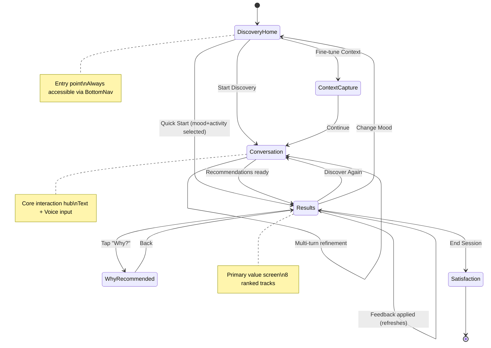
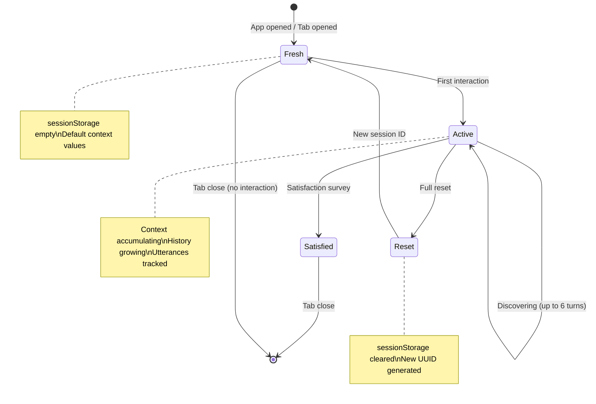

# Spotify Aura — User Flows

Detailed user journey documentation for every interaction path in the Spotify Aura MVP.

This document maps how **Context-Driven Discovery Seekers** move through the product — from first open to discovering meaningful new music. Each flow is described from the user's perspective, annotated with the system behavior happening beneath it.

> **Related docs:** [`problemstatement.md`](./problemstatement.md) · [`architecture.md`](./architecture.md) · [`implementation.md`](./implementation.md)

---

## Table of Contents

1. [Flow Map Overview](#flow-map-overview)
2. [Primary Flow: Complete Discovery Journey](#primary-flow-complete-discovery-journey)
3. [Flow 1: Quick Mood Discovery](#flow-1-quick-mood-discovery)
4. [Flow 2: Conversational Text Discovery](#flow-2-conversational-text-discovery)
5. [Flow 3: Voice Discovery](#flow-3-voice-discovery)
6. [Flow 4: Fine-Tuned Context Discovery](#flow-4-fine-tuned-context-discovery)
7. [Flow 5: Explanation Deep Dive](#flow-5-explanation-deep-dive)
8. [Flow 6: Feedback & Iteration Loop](#flow-6-feedback--iteration-loop)
9. [Flow 7: Session Reset & Re-Discovery](#flow-7-session-reset--re-discovery)
10. [Edge Cases & Error Flows](#edge-cases--error-flows)
11. [Screen Transition Map](#screen-transition-map)
12. [State Changes Per Flow](#state-changes-per-flow)

---

## Flow Map Overview



---

## Primary Flow: Complete Discovery Journey

The canonical "happy path" — a user discovers meaningful new music in a single session.

### Journey Timeline

| Step | User Action | Screen | System Response | Duration |
|---:|---|---|---|---|
| 1 | Opens Spotify Aura | Discovery Home | App loads, shows mood pills + activities | < 1.5s |
| 2 | Taps "Melancholic" mood pill | Discovery Home | Pill highlights; `context.mood = "Melancholic"` | Instant |
| 3 | Taps "Driving" activity card | Discovery Home | Card highlights; `context.activity = "Driving"` | Instant |
| 4 | Taps "Start Discovery" | → AI Conversation | Aura greets: "Hey! You're feeling melancholic and driving — tell me more about what you want to discover." | < 0.5s |
| 5 | Types: "I want emotional, cinematic songs — nothing too mainstream" | AI Conversation | Message appears in thread | Instant |
| 6 | Taps send | AI Conversation | Loading indicator; AI processes | 2–4s |
| 7 | — | → AI Recommendations | 8 ranked tracks appear with album art + one-line hooks | — |
| 8 | Scrolls through tracks | AI Recommendations | — | User-paced |
| 9 | Taps "Why?" on track 3 | → Why Recommended | Four-signal explanation loads | < 2s |
| 10 | Reads explanation, goes back | → AI Recommendations | — | User-paced |
| 11 | Taps "❤️ More" on track 1 | AI Recommendations | Context shifts; new request fires | 2–4s |
| 12 | — | AI Recommendations | Updated 8 tracks appear (seeded by liked track) | — |
| 13 | Satisfied; closes app | — | Satisfaction micro-survey (optional) | — |

**Total time to first recommendation:** ~8–12 seconds from app open.

---

## Flow 1: Quick Mood Discovery

**Entry point:** User knows their mood but doesn't want to type anything.

**User profile:** Low-effort, wants fast results.

```
┌─────────────────────────────────────────────────────────┐
│ DISCOVERY HOME                                          │
│                                                         │
│  User taps: "Euphoric" pill                             │
│  User taps: "Working Out" card                          │
│  User taps: [Start Discovery] button                    │
│                                                         │
└──────────────────────────┬──────────────────────────────┘
                           │
                           ▼
┌─────────────────────────────────────────────────────────┐
│ SYSTEM (invisible to user)                              │
│                                                         │
│  Auto-generates utterance:                              │
│  "I'm feeling euphoric and working out —                │
│   recommend music that matches this energy"             │
│                                                         │
│  Runs full pipeline: intent → Spotify → LLM rank       │
│                                                         │
└──────────────────────────┬──────────────────────────────┘
                           │
                           ▼
┌─────────────────────────────────────────────────────────┐
│ AI RECOMMENDATIONS                                      │
│                                                         │
│  8 tracks appear immediately                            │
│  User skips the conversation step entirely              │
│                                                         │
└─────────────────────────────────────────────────────────┘
```

### Key Characteristics

- **Minimum taps to results:** 3 (mood → activity → Start)
- **No typing required**
- **AI still extracts full intent** from mood + activity + default slider values
- **Conversation screen is skipped** — user lands directly on results

---

## Flow 2: Conversational Text Discovery

**Entry point:** User has a specific, nuanced request they want to articulate.

**User profile:** High intent, wants control and specificity.

### Step-by-Step

**Step 1 — User opens conversation**

The user either taps "Start Discovery" from Home, or navigates directly to the Chat tab.

**Step 2 — Aura greets contextually**

If context is set:
> "Hey! You're feeling melancholic and driving — tell me more about what you want to discover."

If no context set:
> "Hey! I'm Aura. Describe your moment, mood, or what you're doing — I'll find music that fits perfectly."

**Step 3 — User types their request**

Examples of natural language inputs:

| Input | Complexity |
|---|---|
| "something chill" | Low — vague mood only |
| "I'm driving late at night and want emotional songs" | Medium — mood + activity + time |
| "underrated indie artists from the 2010s, nothing on the radio, for deep focus work" | High — genre + era + popularity filter + activity |
| "I just went through a breakup and want to feel it fully" | Emotional — mood inference required |
| "surprise me, something I'd never find on my own" | Exploratory — high novelty |

**Step 4 — AI processes and responds**

System actions (invisible):
1. Combines typed message + existing `DiscoveryContext` + conversation history
2. Sends to OpenAI for structured intent extraction
3. Maps intent to Spotify recommendation parameters
4. Fetches ~50 candidates from Spotify
5. LLM re-ranks to top 8
6. Returns results

User sees:
- Brief loading state (pulsing dots)
- Then directly: track cards with hooks

**Step 5 — Conversation continues (optional)**

The user can refine:
> "Actually, can you make it more acoustic? Less electronic."

System treats this as a **follow-up turn** — incorporates prior intent + new instruction. The conversation maintains up to 6 turns of history for progressive refinement.

### Conversation Thread Visual

```
┌─────────────────────────────────────┐
│  🤖 Aura:                           │
│  "Hey! What are you in the mood     │
│   for today?"                        │
│                                      │
│                        You: 💬       │
│     "Late night driving, emotional   │
│      cinematic stuff"                │
│                                      │
│  🤖 Aura:                           │
│  Found 8 tracks for your late-night  │
│  drive ↓                             │
│                                      │
│  [Track 1] ❤️ 👎 🔀                │
│  [Track 2] ❤️ 👎 🔀                │
│  [Track 3] ❤️ 👎 🔀                │
│  ...                                 │
│                                      │
│                        You: 💬       │
│     "More acoustic, less synths"     │
│                                      │
│  🤖 Aura:                           │
│  Shifting toward acoustic... ↓       │
│                                      │
│  [New Track 1] ❤️ 👎 🔀            │
│  ...                                 │
├─────────────────────────────────────┤
│  [Type or hold 🎤]          [Send]  │
└─────────────────────────────────────┘
```

---

## Flow 3: Voice Discovery

**Entry point:** User prefers speaking over typing — lower friction, richer context in a single utterance.

**User profile:** On-the-go, hands-busy, or simply prefers conversational interaction.

### Step-by-Step



### Voice Interaction States

| State | Visual | User Sees |
|---|---|---|
| **Idle** | Grey mic icon | Mic button in input bar |
| **Listening** | Pulsing purple gradient, scale 1.1x | "Listening..." label + live waveform |
| **Processing** | Spinning indicator | "Processing..." |
| **Transcript shown** | Text appears in input field | Can edit before sending, or auto-sends |
| **Error** | Red flash | "Couldn't hear you — try again or type instead" |

### Voice-Specific UX Rules

1. **Never auto-send on silence.** User must explicitly release the mic or tap send.
2. **Show transcript before sending.** User can edit if Web Speech misheard.
3. **Always offer text fallback.** Voice is an enhancement, not a requirement.
4. **Waveform animation** provides confidence that the system is "hearing" them.

---

## Flow 4: Fine-Tuned Context Discovery

**Entry point:** User taps "Fine-tune Context" from Discovery Home — they want granular control before the AI runs.

**User profile:** Power user, deliberate, wants precise results.

### Context Capture Screen Walkthrough

```
┌─────────────────────────────────────┐
│  FINE-TUNE YOUR DISCOVERY            │
│                                      │
│  ── Energy Level ──────────────────  │
│  Low & chill ●━━━━━━━━━○ High        │
│                    ↑                 │
│              (user drags)            │
│                                      │
│  ── Exploration Level ─────────────  │
│  Stay close ○━━━━━━━━━━● Surprise me │
│                              ↑       │
│                        (user drags)  │
│                                      │
│  ── Artists to Avoid ──────────────  │
│  [Search artists...]                 │
│  × Drake  × Ed Sheeran              │
│                                      │
│  ── Genres to Avoid (optional) ───   │
│  [pop] [country]                     │
│                                      │
│  [Continue to Discovery →]           │
└─────────────────────────────────────┘
```

### Interaction Details

| Control | Input Type | Range | Default | Effect on AI |
|---|---|---|---|---|
| Energy slider | Continuous drag | 0.0–1.0 | 0.5 | Maps to `target_energy` in Spotify API |
| Exploration slider | Continuous drag | 0.0–1.0 | 0.5 | Controls `noveltyLevel` in intent schema |
| Avoid artists | Typeahead search | N/A | Empty | Filters out from candidates |
| Avoid genres | Pill multi-select | N/A | Empty | Excluded from `seed_genres` |

### After Context Capture

User is routed to the **AI Conversation** screen with all context pre-loaded. Their first message now benefits from the full context envelope:

```
System knows:
- Mood: Melancholic (from Home)
- Activity: Driving (from Home)
- Energy: 0.35 (from slider)
- Exploration: 0.85 (from slider)
- Avoid: [Drake, Ed Sheeran]
- Avoid genres: [pop, country]
```

When the user types "emotional cinematic songs," the AI has **far more signal** to work with than the text alone.

---

## Flow 5: Explanation Deep Dive

**Entry point:** User taps "Why?" on any track card in the recommendations list.

**User profile:** Curious, wants to understand the AI's reasoning; validates whether to trust and explore the recommendation.

### Screen Transition

```
┌─────────────────────┐         ┌──────────────────────────┐
│  RECOMMENDATIONS    │         │  WHY THIS TRACK?         │
│                     │         │                          │
│  ┌───────────────┐  │         │  "Midnight City" · M83   │
│  │ Midnight City │  │  tap    │                          │
│  │ M83           │──┼────────▶│  ┌────────────────────┐  │
│  │ [Why?]        │  │         │  │ 🟣 Mood Match      │  │
│  └───────────────┘  │         │  │ High energy synths  │  │
│                     │         │  │ + nostalgic tone...  │  │
│  ┌───────────────┐  │         │  └────────────────────┘  │
│  │ Breathe       │  │         │                          │
│  │ Télépopmusik  │  │         │  ┌────────────────────┐  │
│  │ [Why?]        │  │         │  │ 🔵 Context Match   │  │
│  └───────────────┘  │         │  │ 105 BPM, building   │  │
│                     │         │  │ layers — road trip   │  │
│                     │         │  └────────────────────┘  │
│                     │         │                          │
│                     │         │  ┌────────────────────┐  │
│                     │         │  │ 🩷 Novelty Level   │  │
│                     │         │  │ Adjacent — similar   │  │
│                     │         │  │ sonic space, new era │  │
│                     │         │  └────────────────────┘  │
│                     │         │                          │
│                     │         │  ┌────────────────────┐  │
│                     │         │  │ 📝 Rationale       │  │
│                     │         │  │ Full narrative...    │  │
│                     │         │  └────────────────────┘  │
│                     │         │                          │
│                     │         │  [← Back to Results]     │
└─────────────────────┘         └──────────────────────────┘
```

### What the Four Signals Mean to the User

| Signal | User Question It Answers | Grounded In |
|---|---|---|
| **Mood Match** | "Does this actually fit how I'm feeling?" | Audio features (energy, valence) + intent mood |
| **Context Match** | "Is this right for what I'm doing right now?" | Tempo, energy level + intent activity |
| **Novelty Level** | "How far outside my comfort zone is this?" | Genre/artist distance from seed genres |
| **Rationale** | "Give me the full story — why THIS track?" | Narrative combining all signals |

### Loading Pattern

Explanations are **lazily loaded** — the API call to `/api/explain` only fires when the user taps "Why?" This means:

- Recommendations screen loads fast (no explanation tokens burned upfront)
- Explanation screen shows a brief skeleton (< 2s) then fills in
- If user never taps "Why?", zero explanation tokens are spent

---

## Flow 6: Feedback & Iteration Loop

**Entry point:** User is on the Recommendations screen and wants to steer the results without starting over.

**User profile:** Engaged, exploring, wants to dig deeper or shift direction within the session.

### Feedback Actions & Their Effects



### Iteration Example (3 Rounds)

| Round | User Action | What Changes | Result Shift |
|---|---|---|---|
| 1 | Initial request: "late night emotional driving songs" | — | 8 tracks: synth-pop, indie, shoegaze |
| 2 | Taps ❤️ on Radiohead track | Seeds nudge toward Radiohead's audio signature | More art-rock, atmospheric, lower valence |
| 3 | Taps 🔀 "More adventurous" | Exploration 0.5 → 0.7; novelty → "exploratory" | Introduces post-rock, ambient electronica, less familiar artists |

### Visual Feedback Confirmation

When feedback is applied:
1. A subtle toast/animation confirms the action ("Making it wilder...")
2. Track list shimmers / shows skeletons briefly
3. New tracks fade in (optimistic UI — tracks from Stage 1 show instantly while LLM re-ranks)

---

## Flow 7: Session Reset & Re-Discovery

**Entry point:** User wants to start completely fresh — different mood, different context.

### Paths to Reset

| Trigger | What Resets | What Persists |
|---|---|---|
| "🎭 Change mood" feedback | Mood, activity, intent | Conversation history, avoid list, slider values |
| Navigate to Home via BottomNav | Nothing auto-resets | Full session state preserved |
| "Discover Again" button on results | Intent, recommendations | Context, conversation, avoid list |
| Long-press Aura logo (power user) | Everything | New session ID generated |

### Full Reset Flow

```
User taps "Change mood"
    │
    ▼
Context Capture / Home (mood cleared)
    │
    User picks new mood: "Energetic"
    User picks new activity: "Working Out"
    │
    ▼
Conversation Screen
    │
    Aura: "Switching gears! You're feeling energetic
           and working out now. What kind of energy
           do you want?"
    │
    User: "Aggressive trap beats, fast tempo"
    │
    ▼
New recommendations (completely different from before)
```

---

## Edge Cases & Error Flows

### Error Flow 1: AI Service Unavailable

```
User submits request
    │
    ▼
API call to OpenAI fails (timeout / 500)
    │
    ▼
┌─────────────────────────────────────┐
│  ⚠️ ERROR STATE                     │
│                                      │
│  "Discovery is temporarily           │
│   unavailable. Try again?"           │
│                                      │
│  [Retry]  [Try different wording]    │
└─────────────────────────────────────┘
```

**Recovery options:**
- Retry (same request)
- Modify input and try again
- Fall back to browse mode (just mood-based Spotify recs without LLM)

---

### Error Flow 2: Spotify Rate Limited

```
User submits request → Intent extracts successfully
    │
    ▼
Spotify returns 429 (rate limited)
    │
    ▼
System retries with exponential backoff (up to 3x)
    │
    ├── Success → normal flow continues
    │
    └── All retries fail
         │
         ▼
    ┌─────────────────────────────────────┐
    │  ⚠️ "Music catalog temporarily       │
    │   busy. Results may be limited."     │
    │                                      │
    │  Shows partial results if available  │
    └─────────────────────────────────────┘
```

---

### Error Flow 3: Voice Recognition Fails

```
User holds mic → speaks
    │
    ▼
Web Speech API returns empty / error
    │
    ├── If Whisper available:
    │       Auto-fallback to Whisper
    │       Show: "Switching to high-accuracy mode..."
    │       Whisper transcribes → continues normally
    │
    └── If both fail:
            ┌────────────────────────────────────┐
            │  "Couldn't catch that. Try again    │
            │   or type your request instead."    │
            │                                     │
            │  [🎤 Try again]  [⌨️ Type instead] │
            └────────────────────────────────────┘
```

---

### Error Flow 4: Empty Recommendations

```
Pipeline runs → Spotify returns 0 matching candidates
(e.g., overly restrictive avoid lists + niche genre combo)
    │
    ▼
┌─────────────────────────────────────┐
│  EMPTY STATE                         │
│                                      │
│  🎵 "Hmm, that's a tough combo.     │
│   Try loosening your filters or      │
│   describing your vibe differently." │
│                                      │
│  [Adjust Context]  [Try again]       │
└─────────────────────────────────────┘
```

---

### Error Flow 5: Hallucinated Track ID (Internal Guard)

```
LLM re-ranker returns a track ID not in candidate set
    │
    ▼
System filters it out (validation layer)
    │
    ▼
If remaining tracks ≥ 5: show them normally
If remaining tracks < 5: re-run ranking with stricter prompt
```

This is **invisible to the user** — the anti-hallucination guard operates silently.

---

### Edge Case: User Sends Empty/Gibberish

```
User types: "asdfghjkl" or sends empty message
    │
    ▼
AI still attempts intent extraction
    │
    ├── If context has mood/activity set:
    │       Uses context alone, ignores gibberish
    │       Returns reasonable results
    │
    └── If no context at all:
            Aura responds conversationally:
            "I didn't quite get that! Try describing
             your mood, what you're doing, or what
             kind of music you're curious about."
```

---

## Screen Transition Map

Complete map of all possible navigation paths between screens:



### Navigation Accessibility

| Screen | Reachable From | Exit Points |
|---|---|---|
| Discovery Home | App open, BottomNav, "Change mood" feedback | Conversation, Context, Quick Start |
| Context Capture | Discovery Home | Conversation |
| AI Conversation | Home, Context, Results ("Discover Again"), BottomNav | Results |
| AI Recommendations | Conversation, Quick Start, Feedback loop | Why, Conversation, Home, Satisfaction |
| Why Recommended | Results (per-track) | Results (back) |
| Satisfaction Survey | Results (end session) | Close app |

---

## State Changes Per Flow

How `DiscoverySession` state evolves across each major flow:

### Flow: Quick Mood Discovery

```typescript
// Step 1: User selects mood
session.context.mood = "Euphoric"

// Step 2: User selects activity
session.context.activity = "Working Out"

// Step 3: System auto-generates and extracts intent
session.lastIntent = {
  mood: "euphoric",
  activity: "workout",
  energyTarget: 0.9,
  valenceTarget: 0.85,
  seedGenres: ["edm", "dance", "hip-hop"],
  noveltyLevel: "adjacent",
  ...
}

// Step 4: Recommendations arrive
session.recommendations = [/* 8 tracks */]
session.history = ["trackId1", "trackId2", ...]
```

### Flow: Conversational with Feedback

```typescript
// Initial state
session.context = { mood: "Melancholic", activity: "Driving", energy: 0.4, exploration: 0.5, ... }
session.utterances = []

// After user types
session.utterances = [
  { role: "user", text: "emotional cinematic songs", timestamp: 1719... }
]

// After AI responds
session.utterances = [
  { role: "user", text: "emotional cinematic songs", timestamp: 1719... },
  { role: "aura", text: "Found 8 tracks for your late-night drive", timestamp: 1719... }
]
session.lastIntent = { mood: "melancholic", energyTarget: 0.45, ... }
session.recommendations = [/* 8 tracks */]

// After "More adventurous" feedback
session.context.exploration = 0.7  // was 0.5
// Next call uses updated context → different results

// After "Less similar" on a specific track
session.context.avoidArtists = [..., { id: "xyz", name: "M83" }]
// M83 excluded from future results
```

### Flow: Voice Discovery

```typescript
// Voice capture adds utterance same as text
session.utterances = [
  { role: "user", text: "I'm driving late at night and want emotional songs", timestamp: ... }
]
// Pipeline proceeds identically from here
```

---

## Micro-Interactions & Timing

### Loading State Durations

| Transition | Expected Wait | What User Sees |
|---|---|---|
| Mood pill tap → highlight | 0ms | Instant color change |
| Send message → intent extracted | 1–2s | Pulsing dots in conversation |
| Intent → recommendations appear | 2–3s | Track card skeletons shimmer |
| Tap "Why?" → explanation loads | 1–2s | Four skeleton cards |
| Feedback → new results | 2–4s | Track list shimmers, then refreshes |
| Voice capture → transcript | 0.5–1s | Live text appears as user speaks |

### Animation Choreography

```
[User taps Send]
    0ms    → Input clears, message bubble slides up
    100ms  → Aura's typing indicator appears (3 pulsing dots)
    ~2000ms → Typing indicator morphs into track cards
    2100ms → Track 1 fades in (opacity 0→1, translateY 8→0)
    2200ms → Track 2 fades in (staggered 100ms)
    2300ms → Track 3 fades in
    ...
    2800ms → All 8 tracks visible
```

---

## Session Lifecycle



### Session Boundaries

| Event | Session Continues? | Data Preserved? |
|---|---|---|
| Page refresh (F5) | Yes | Yes (sessionStorage) |
| Navigate between screens | Yes | Yes |
| Close tab | No | No (sessionStorage dies) |
| Open in new tab | New session | No |
| Clear browser data | New session | No |

---

## Accessibility Flows

### Keyboard-Only Discovery

Every flow is completable without touch:

| Action | Keyboard Shortcut |
|---|---|
| Navigate between pills/cards | `Tab` / `Shift+Tab` |
| Select mood/activity | `Enter` / `Space` |
| Adjust slider | `Arrow Left` / `Arrow Right` |
| Focus input | `Tab` into input field |
| Send message | `Enter` |
| Open "Why?" | `Enter` on focused "Why?" link |
| Apply feedback | `Enter` on focused feedback button |

### Screen Reader Announcements

| Event | ARIA Announcement |
|---|---|
| Recommendations loaded | "8 tracks discovered. Scroll to explore." |
| Feedback applied | "Preferences updated. Loading new recommendations." |
| Voice listening started | "Listening for your voice input." |
| Error occurred | "Error: [message]. Retry button available." |
| Explanation loaded | "Explanation for [track name] loaded." |

---

## Analytics Events (Telemetry Touchpoints)

Every flow generates trackable events for Phase 9 evaluation:

| User Action | Event Name | Key Data |
|---|---|---|
| Selects mood | `context.mood_selected` | mood value |
| Selects activity | `context.activity_selected` | activity value |
| Adjusts slider | `context.slider_changed` | slider name, value |
| Sends text message | `discovery.text_submitted` | utterance length, turn number |
| Uses voice | `discovery.voice_submitted` | duration, confidence, fallback used |
| Receives recommendations | `discovery.results_shown` | track count, latency |
| Taps "Why?" | `explain.requested` | trackId |
| Applies feedback | `feedback.applied` | action type, trackId |
| Rates satisfaction | `session.satisfaction` | 1–5 rating |
| Session ends | `session.ended` | total turns, total tracks shown |

---

## Related Documents

- [`problemstatement.md`](./problemstatement.md) — User segment, interaction modes, MVP screen definitions
- [`architecture.md`](./architecture.md) — System design, data flow, technical constraints
- [`implementation.md`](./implementation.md) — Component code, API contracts, state management
